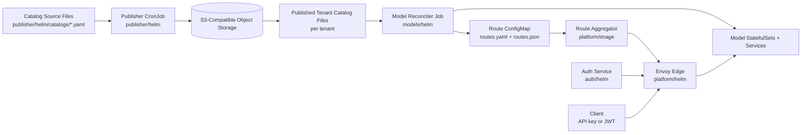
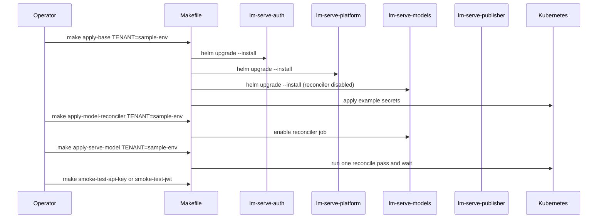

# LM Serve Module

This module provides a split-chart, tenant-aware baseline for publishing model artifacts and serving them through vLLM + Envoy with auth controls.

The design goal is simple:
- Publisher owns source-of-truth model intent.
- Model runtime consumes published catalogs.
- Platform owns edge routing/auth integration.
- Tenants are isolated through namespace + values overlays.

## Summary

- Use `TENANT=<tenant-name>` for tenant-scoped model workflows.
- Keep publisher installed in its own namespace (commonly `lm-serve-publisher`).
- Keep one model values overlay per tenant: `models/helm/values.<tenant>.yaml`.
- Keep one source catalog per tenant: `publisher/helm/catalogs/<tenant>.yaml`.

## Components

- `Makefile`
  - Primary operator entrypoint for render/apply/reconcile/smoke flows.
- `auth/helm/`
  - Auth service runtime and auth secret wiring.
- `auth/image/`
  - Python auth service source + image build context.
- `platform/helm/`
  - Envoy edge and route-aggregation integration.
- `platform/image/`
  - Route aggregation runtime for multi-namespace route updates.
- `models/helm/`
  - Model runtime consumer chart + reconciler job.
- `models/image/`
  - Model reconciler runtime image source + Docker build context.
- `publisher/helm/`
  - Source catalogs, publisher CronJob, RBAC, and tenant catalog publication.
- `publisher/image/`
  - Model artifact publisher source + image build context.

## Architecture



## Deployment Order



## Tenant Model

- `TENANT` selects the model chart overlay file `values.<tenant>.yaml`.
- `NAMESPACE` controls where model runtime and platform resources land.
- `AUTH_NAMESPACE` defaults to `TENANT` when set, else `NAMESPACE`.

Auth patterns:
- Per-tenant auth: `AUTH_NAMESPACE=<tenant-namespace>` per tenant.
- Shared auth: one shared `AUTH_NAMESPACE` used by multiple tenants.

## First-Time Happy Path

1. Review available targets.

```bash
make help
```

2. Render all charts for your tenant.

```bash
make render-helm-template TENANT=sample-env
```

3. Install baseline components.

```bash
make apply-base TENANT=sample-env
```

4. Reconcile model runtime from the published catalog.

```bash
make apply-serve-model TENANT=sample-env
```

5. Validate inference path.

```bash
make smoke-test-api-key API_KEY=<api-key>
# or
make smoke-test-jwt JWT_TOKEN=<jwt>
```

6. Full one-command flow (after image settings are ready).

```bash
make happy-apply TENANT=sample-env API_KEY=<api-key>
```

## Recurrent Operator Happy Paths

- Update one tenant runtime settings and apply:

```bash
make apply-base TENANT=dev-west NAMESPACE=lm-serve-dev-west
make apply-model-reconciler TENANT=dev-west NAMESPACE=lm-serve-dev-west MODEL_RECONCILER_IMAGE_REGISTRY=<registry> MODEL_RECONCILER_IMAGE_REPOSITORY=vllm-catalog-deployer MODEL_RECONCILER_IMAGE_TAG=0.1.0
```

- Keep continuous reconciliation on:

```bash
make deploy-watch-local TENANT=dev-west NAMESPACE=lm-serve-dev-west MODEL_RECONCILER_IMAGE_REGISTRY=<registry> MODEL_RECONCILER_IMAGE_REPOSITORY=vllm-catalog-deployer MODEL_RECONCILER_IMAGE_TAG=0.1.0
```

- Publish artifact catalogs independently:

```bash
make apply-model-publisher PUBLISHER_IMAGE_REGISTRY=<registry> PUBLISHER_IMAGE_REPOSITORY=lm-serve-model-publisher PUBLISHER_IMAGE_TAG=0.1.0
```

## Customization Controls

Core controls:
- `TENANT`: selects `models/helm/values.<tenant>.yaml`.
- `NAMESPACE`: target runtime namespace.
- `AUTH_NAMESPACE`: auth deployment namespace.
- `HELM_EXTRA_ARGS`: additional Helm flags (`-f`, `--set`, etc).

Image controls:
- `{AUTH,MODEL_RECONCILER,PUBLISHER,ROUTE_AGGREGATOR}_IMAGE_REGISTRY` (each defaults to `localhost`, meaning the local node's image cache)
- `{AUTH,MODEL_RECONCILER,PUBLISHER,ROUTE_AGGREGATOR}_IMAGE_REPOSITORY`
- `{AUTH,MODEL_RECONCILER,PUBLISHER,ROUTE_AGGREGATOR}_IMAGE_TAG`
- `AUTH_IMAGE`, `MODEL_RECONCILER_IMAGE`, `PUBLISHER_IMAGE`, `ROUTE_AGGREGATOR_IMAGE` (composed `<registry>/<repository>:<tag>`; set directly to override the parts above)

Reconciler controls:
- `MODEL_RECONCILER_JOB_NAME`
- `MODEL_RECONCILER_WATCH_INTERVAL_SEC`
- `MODEL_SERVICE_TYPE`
- `CATALOG_CONFIGMAP`
- `CATALOG_KEY`

Release controls:
- `FORCE=true`: bypass cluster confirmation prompts.
- `PUBLISH_IF_MISSING=true`: skip image push when registry already has the tag.

## Tenant Artifacts: Source vs Consumer

- Source-of-truth catalogs:
  - `publisher/helm/catalogs/<tenant>.yaml`
- Consumer runtime overlays:
  - `models/helm/values.<tenant>.yaml`

This separation keeps model intent and runtime policy independently evolvable.

## Publisher Notes

- Publisher chart install does not require `TENANT`.
- Tenant selection for publication is managed in `publisher/helm/values.yaml` via `consumer.catalogs[*].tenant` and `enabled`.

## Cloud Portability

Data-plane portability is intentional:
- S3-compatible APIs (endpoint/bucket/region) instead of cloud-specific SDK lock-in.
- Cluster-level portability through chart values and labels.

To move clouds, update:
- storage endpoint/credentials/bucket conventions
- storage classes
- node selectors/tolerations/affinity in tenant overlays

## Related Docs

- `README.install.md`
- `README.inference-usage.md`
- `README.multiple-tenants.md`
- `models/README.md`
- `models/helm/README.md`
- `models/image/README.md`
- `publisher/README.md`
- `publisher/helm/README.md`
- `publisher/image/README.md`
- `auth/README.md`
- `auth/helm/README.md`
- `auth/image/README.md`
- `platform/README.md`
- `platform/helm/README.md`
- `platform/image/README.md`
