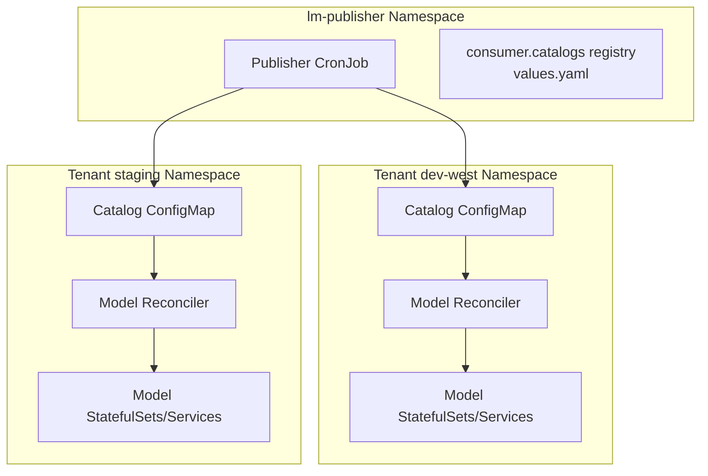
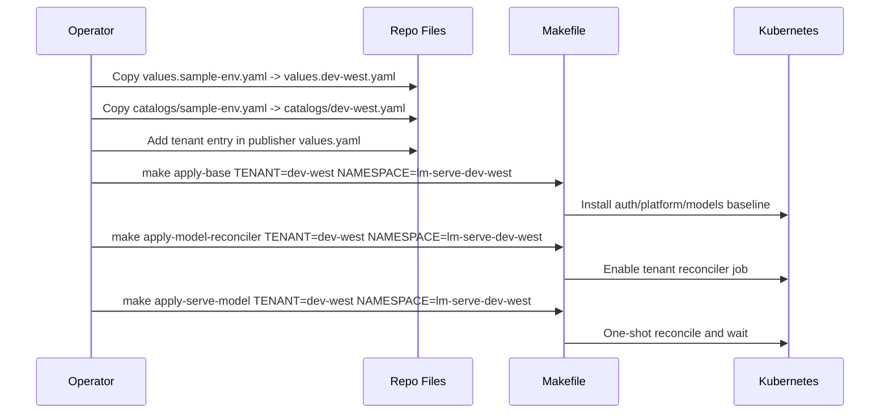

# Multiple Tenants On One Cluster

This guide focuses on how to run multiple lm-serve tenants safely on a single Kubernetes cluster.

## What "multiple tenants" means here

A tenant is a deployment lane with independent:
- model runtime overrides (`helm/lm-serve-models/values.<tenant>.yaml`)
- source catalog (`helm/lm-serve-publisher/catalogs/<tenant>.yaml`)
- rollout cadence (apply/reconcile schedule)
- optional namespace and auth boundary

## Why run multiple tenants on one cluster

- Promotion lanes: dev -> staging -> prod-like validation.
- Team isolation: independent model and rollout ownership.
- Cost efficiency: shared GPU pool with namespace governance.
- A/B runtime tuning: compare serving config across tenants.

## When to split clusters instead

- strict blast-radius requirements
- hard compliance/account isolation requirements
- heavy noisy-neighbor GPU contention

## Isolation Controls You Must Keep

1. Namespace isolation
- Use one namespace per tenant for runtime workloads.

2. Values isolation
- Keep a dedicated model values overlay per tenant.

3. Catalog isolation
- Keep one source catalog file per tenant.

4. Secret isolation
- Separate object storage and auth secrets by namespace/tenant strategy.

5. Resource governance
- Use quotas/limits to prevent one tenant from starving others.

## Multi-Tenant Topology



## Tenant Creation Workflow



## Step-by-Step: Add a New Tenant

1. Create tenant files.

```bash
cp helm/lm-serve-models/values.sample-env.yaml helm/lm-serve-models/values.dev-west.yaml
cp helm/lm-serve-publisher/catalogs/sample-env.yaml helm/lm-serve-publisher/catalogs/dev-west.yaml
```

2. Register the tenant in `helm/lm-serve-publisher/values.yaml` under `consumer.catalogs`.

Example shape:

```yaml
consumer:
  catalogs:
    - tenant: dev-west
      enabled: true
      file: dev-west.yaml
      configMapName: lm-serve-model-catalog-dev-west
      namespace: lm-serve-dev-west
      serviceAccountName: vllm-catalog-model-reconciler
      secretName: lm-serve-dev-west-catalog-credentials
```

3. Render and validate.

```bash
make render-helm-template TENANT=dev-west
```

4. Install baseline for that tenant.

```bash
make apply-base TENANT=dev-west NAMESPACE=lm-serve-dev-west
```

5. Reconcile model runtime.

```bash
make apply-model-reconciler TENANT=dev-west NAMESPACE=lm-serve-dev-west MODEL_RECONCILER_IMAGE=<registry>/vllm-catalog-deployer:0.1.0
make apply-serve-model TENANT=dev-west NAMESPACE=lm-serve-dev-west MODEL_RECONCILER_IMAGE=<registry>/vllm-catalog-deployer:0.1.0
```

## Auth Strategy Across Tenants

Per-tenant auth:
- Set `AUTH_NAMESPACE` equal to each tenant namespace.

Shared auth:
- Reuse one `AUTH_NAMESPACE` for multiple tenants.

Examples:

```bash
make apply-base TENANT=dev-west NAMESPACE=lm-serve-dev-west AUTH_NAMESPACE=lm-serve-auth-shared
make apply-base TENANT=staging NAMESPACE=lm-serve-staging AUTH_NAMESPACE=lm-serve-auth-shared
```

## Recurrent Operations

- Enable/disable a tenant publication lane: flip `consumer.catalogs[*].enabled`.
- Roll one tenant only: run `apply-base` and `apply-model-reconciler` with that `TENANT`.
- Change runtime behavior for one tenant: edit only that tenant's `values.<tenant>.yaml`.

## Practical Guardrails

- Keep tenant names DNS-safe (`[a-z0-9-]`) since they influence route segments.
- Avoid sharing model runtime namespaces between tenants.
- Track GPU usage and reconcile intervals per tenant.
- Keep publisher namespace dedicated and stable.
